# Azure APIM with Managed Identity to connect to Azure AI Foundry
How to use Azure APIM and protect APIs with Microsoft Entra ID (using Managed Indentity). When Client is calling APIM API endpoint it will need to provide token + subscription key. Authorization to AI Foundry (which is backend for API) is done using system assigned managed identities. 
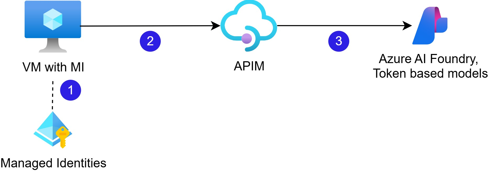

# 1. Micrsoft Entra ID: Create Managed Identity
1. Create Managed Identity (no Azure Role Assignments) and record "Client ID" value.
Note that No Role Assignments are needed at this step. 
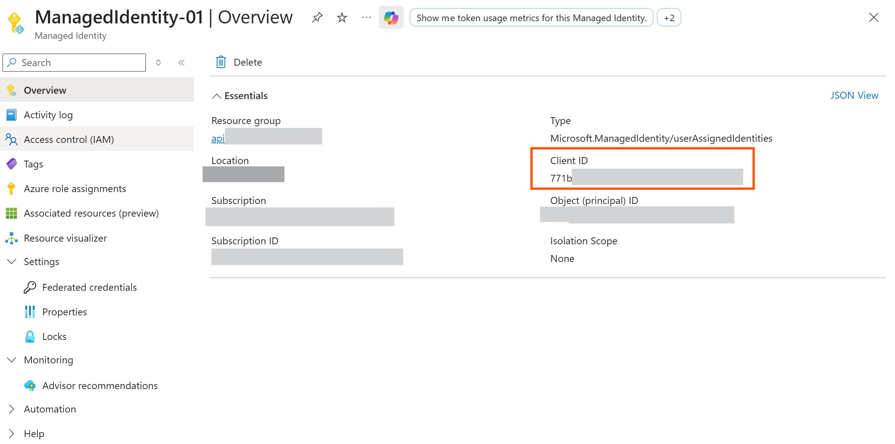
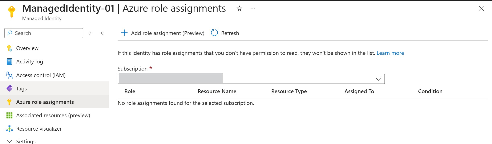

# 2. Assign created Managed Identity to Virtual Machine (VM)
1. VM: create a new VM where you'll run the test code. Note, the testing can only be done from resource in Azure.
2. VM: navigate to "Security" -> "Identity" and assign Managed Identity created at step 1 under "User assigned".
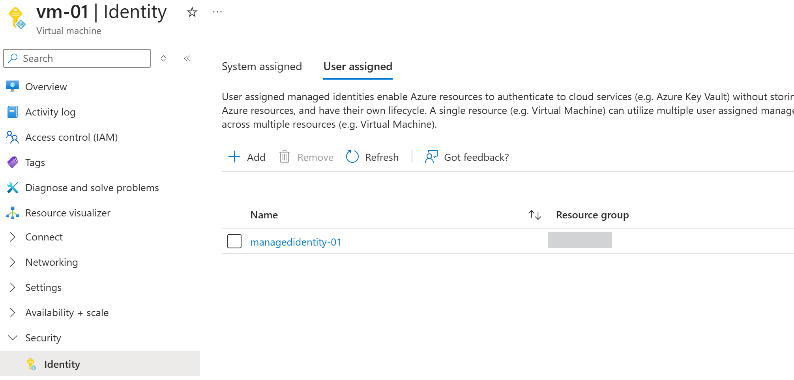

# 3. APIM - Create Named Values
1. In APIM create Named Value storing your Managed Identity Client ID value, type select Secret. 
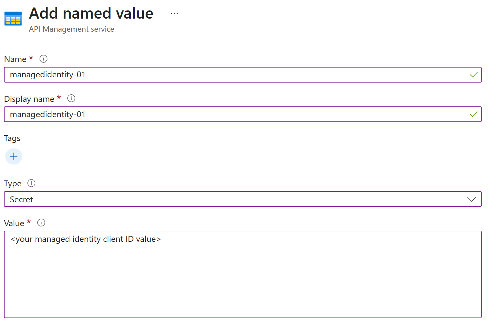
2. Create Named Value storing Tenant ID in the same way.

# 4. Policy Configuration at APIM
1. Your API policy *inbound* section should contain the JWT validation policy with required claims (managed identity client ID).
2. Example of the policy is here apim_test/api_policy.xml . Note that this policy first should validate the received token for ManagedIdentity-01 and later retrieve another one for MI to access Azure AI Foundry. 
3. And the policy uses named values {{managed-identity-01}} and {{tenant-id}} created at a previous step. 
4. As the policy match="any" you can validate multiple managed identities in the claims.

# 5. Test the requests are reaching Azure AI Foundry
1. Note that you can *only* test this configuration from inside Azure. In current example your client is VM in Azure.
2. Your client code should include essentially 2 steps: 
- get the access token for Managed Identity
- call API endpoint (with token + subscription key)
3. The client (in this case VM) needs to pass APIM Subscription Key + token.
Sample code is provided in apim_test folder.

# Prerequisite 1: Basic APIM Configuration
0. Create Azure AI Foundry Resource and Model deployment beforehand (use foundry resource not hub based projects). 
1. Import API from Azure AI Foundry. Foundry /models endpoint will be used. 
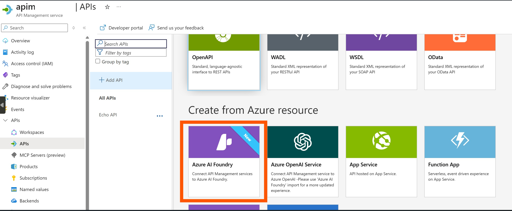
2. Select AI Service - Select Azure AI Foundry Resource which contains needed Deployments 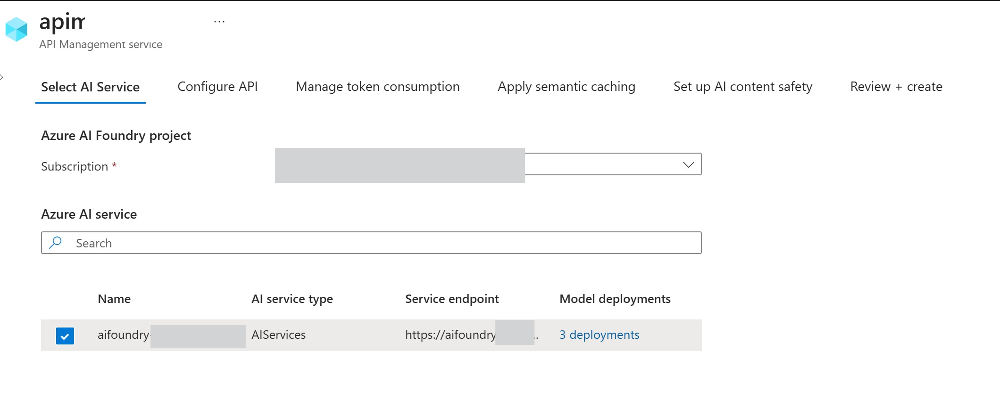
3. Configure API - provide display name for your api, and also path. Select "Azure AI" with /models endpoint.
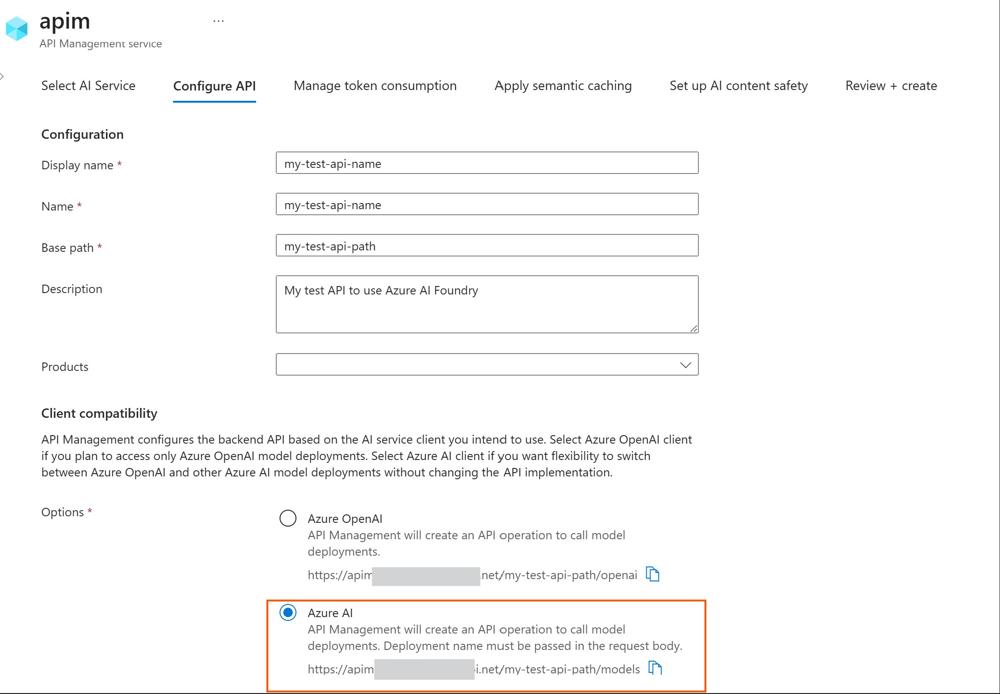
4. Manage token consumption, apply semantic cashing, set up ai content safety - leave defaults. 
5. Review and create your API. There will be created 4 operations one of them will be /chat/completions. Also make sure subscription key is required. You should specify the name of the header for it to be passed or use the default one "api-key" (check in the "Settings" tab).
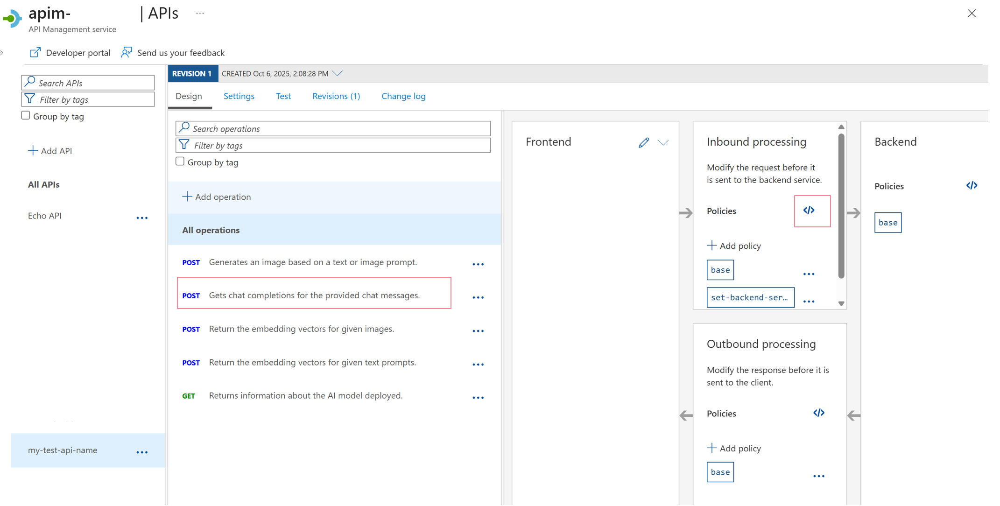
6. Create subscription key to access this API.

# Prerequisite 2: APIM access to AI Foundry 
1. APIM: API Backend configuration in APIM: Authorization credentials: should be using Managed Identity "enabled", client identity - system assigned identity, resource ID corresponding to cognitive services.
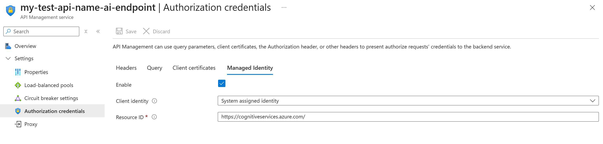
2. Azure AI Foundry: IAM: verify the system assigned managed identity of APIM has Azure AI User Role assigned. 
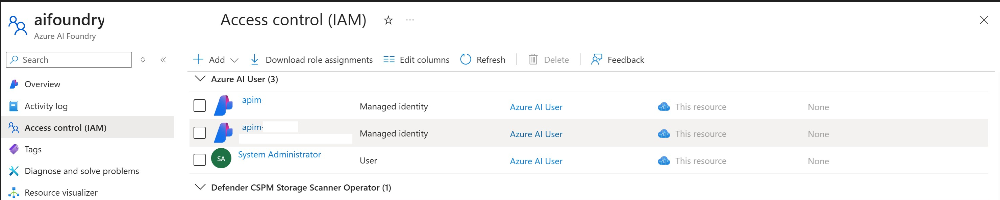